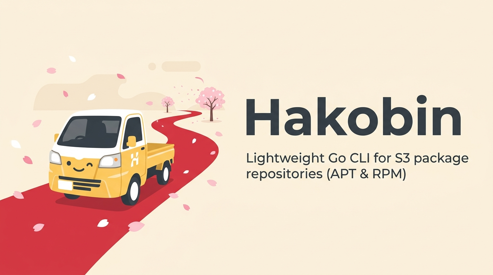

# Hakobin

<p align="center">
  
</p>

<p align="center">
  <a href="https://github.com/shyim/hakobin/actions/workflows/ci.yml"></a>
  <a href="https://goreportcard.com/report/github.com/shyim/hakobin"></a>
  <a href="https://github.com/shyim/hakobin/releases"></a>
  <a href="https://github.com/shyim/hakobin/blob/main/LICENSE"></a>
</p>

**Hakobin** (from Japanese *箱便* - "box delivery") is a lightweight, zero-dependency Go CLI designed to create and maintain Debian (APT) and RedHat (RPM/YUM) package repositories directly on S3-compatible storage (like AWS S3, MinIO, Cloudflare R2, or DigitalOcean Spaces).

Instead of running a heavy, expensive repository manager server (like Nexus, Artifactory, or Pulp), Hakobin runs as a stateless CLI tool (e.g., in your CI/CD pipeline) to update static repository metadata directly on your storage bucket.

---

## Key Features

*   **Zero Infrastructure:** No databases to run, no background workers. Your repository is just a set of static files on S3.
*   **Cryptographically Signed:** Native integration with OpenPGP/GPG to sign repository releases (DEB `Release.gpg`/`InRelease`, RPM `repomd.xml.asc`) and package binaries (RPM GPG check).
*   **Safe Concurrent Updates:** Uses S3 object locking to prevent race conditions when concurrent builds upload packages at the same time.
*   **CDN Purge Support:** Built-in cache invalidation for **AWS CloudFront** and **Cloudflare** to make sure updates are instantly visible at the edge.
*   **No Vendor Lock-in:** All repositories follow standard Debian and RedHat layout specifications. You can migrate your files to any other HTTP hosting solution with zero config changes on your clients.

---

## Installation

### Using GitHub Actions
You can install the latest release of Hakobin inside your GitHub Action runners using [action-install-gh-release](https://github.com/jaxxstorm/action-install-gh-release):

```yaml
- name: Install Hakobin
  uses: jaxxstorm/action-install-gh-release@v1.11.0
  with:
    repo: shyim/hakobin
```

### Go Install
To install globally on your system using Go:

```bash
go install github.com/shyim/hakobin@latest
```

### From Source
```bash
git clone https://github.com/shyim/hakobin.git
cd hakobin
go build -o hakobin main.go
```

---

## Configuration

Hakobin is configured entirely via environment variables:

```bash
# Storage Credentials
export AWS_ACCESS_KEY_ID="your-access-key"
export AWS_SECRET_ACCESS_KEY="your-secret-key"
export S3_BUCKET_NAME="your-bucket-name"
export AWS_REGION="us-east-1"

# (Optional) For MinIO, R2, or custom S3 endpoints
export S3_ENDPOINT="http://localhost:9000"
export S3_USE_PATH_STYLE="true"

# Public URL and Signing GPG Key
export HAKOBIN_PUBLIC_URL="https://packages.example.com"
export GPG_PRIVATE_KEY="$(cat signing-key.gpg)"
```

---

## Quick Start CLI Usage

### Debian/APT Repositories

```bash
# 1. Initialize the APT repository
hakobin deb init \
  --origin "Example Inc" \
  --label "Example Packages" \
  --distributions stable \
  --components main \
  --architectures amd64,all

# 2. Upload a package
hakobin deb upload ./package.deb --distribution stable --component main

# 3. List uploaded packages
hakobin deb list

# 4. Remove a package version
hakobin deb remove nginx --version 1.2.3 --architecture amd64 --force
```

### RedHat/RPM Repositories

```bash
# 1. Initialize the RPM repository
hakobin rpm init --repo stable --arch x86_64

# 2. Upload a package
hakobin rpm upload ./package.rpm --repo stable --arch x86_64

# 3. List uploaded packages
hakobin rpm list --repo stable --arch x86_64

# 4. Remove a package version
hakobin rpm remove nginx --epoch 0 --version 1.2.3 --release 1.el9 --arch x86_64 --repo stable --repo-arch x86_64 --force
```

---

## Full Documentation

Hakobin includes comprehensive documentation detailing:
- [APT Repository Setup Guide](docs/apt-setup.md)
- [RPM Repository Setup Guide](docs/rpm-setup.md)
- [CDN & Caching Integration](docs/cdn-integration.md)
- [GPG Key Selection](docs/signing-keys.md)
- [Safe Cryptographic Key Rotation](docs/key-rotation.md)
- [S3 Data Layout & Storage Mechanics](docs/data-storage.md)
- [Migrating Away Guide](docs/migration.md)

### Running the Docs Locally
The documentation is powered by **Zensical**. To build and view the documentation locally, run:

```bash
uvx zensical serve
```

---

## License

This project is licensed under the MIT License - see the [LICENSE](LICENSE) file for details.
