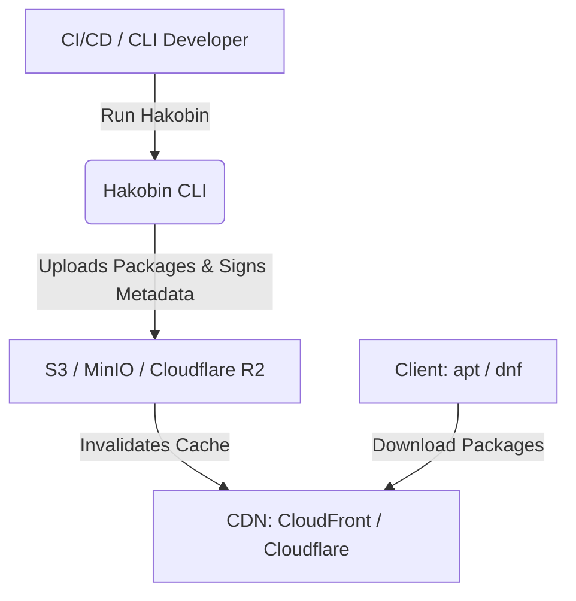

# Welcome to Hakobin

  

Hakobin is a lightweight, zero-dependency Go CLI designed to create and maintain Debian (APT) and RedHat (RPM/YUM) package repositories directly on S3-compatible storage (like AWS S3, MinIO, Cloudflare R2, or DigitalOcean Spaces).

Instead of running a complex, heavy, and expensive repository manager server (like Nexus, Artifactory, or Pulp), Hakobin runs as a simple CLI tool (e.g., in your CI/CD pipeline) to update static repository metadata directly on your storage bucket.

---

## Why Hakobin?

For junior developers and teams starting out, package repository hosting can feel like a black box. Hakobin is built to solve this by providing:

*   **Zero Infrastructure Overhead:** No servers to run or database to maintain. Your repository is just a set of static files in an S3 bucket.
*   **Highly Cost-Effective:** You only pay for standard object storage and CDN egress (which is often free or very cheap, e.g., Cloudflare R2).
*   **Security by Design:** Supports repository and package signing via OpenPGP/GPG.
*   **Fast Distribution:** Easily pairable with a CDN (CloudFront/Cloudflare) to serve packages at lightning speed worldwide.
*   **No Vendor Lock-in:** Hakobin structures your repositories using standard Debian and RPM formats. If you decide to migrate, you can move your files to any other HTTP hosting solution or tool with zero configuration changes on your clients.

---

## How It Works

1.  **Build:** You build your `.deb` or `.rpm` packages in your normal build process or CI pipeline.
2.  **Upload & Sign:** You run the Hakobin CLI, passing in your packages and a private GPG key.
3.  **Process:** Hakobin downloads the current metadata, registers your new packages, re-calculates dependencies and hashes, signs the metadata files, and uploads everything back to S3.
4.  **Distribute:** Your CDN serves these files to target machines running standard tools like `apt-get` or `dnf`.

---

## Next Steps

Get started with Hakobin by following our operational guides:

*   [APT Repository Setup](apt-setup.md): Configure an S3 bucket, initialize APT metadata, upload packages, and setup clients.
*   [RPM Repository Setup](rpm-setup.md): Configure and run an RPM/YUM repository.
*   [CDN Integration](cdn-integration.md): Setup edge caching and automatic cache purges.
*   [Signing Keys & Key Rotation](key-rotation.md): Understand cryptography in Hakobin and safely rotate keys without breaking production nodes.
