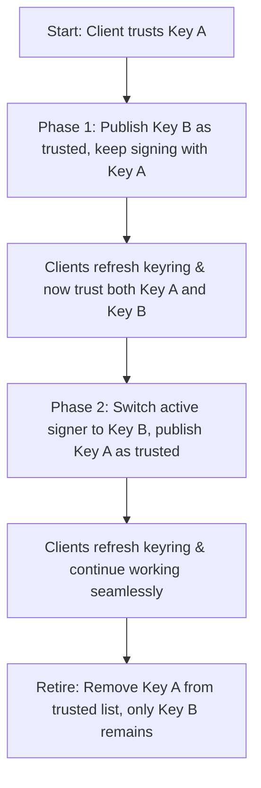

# Key Rotation Guide

Key rotation is the process of replacing an active GPG signing key with a new one. It is a critical security practice to perform regularly, and is necessary if a key expires or is compromised.

---

## The Golden Rule of Key Rotation

> [!IMPORTANT]
> **Clients must trust the new public key BEFORE you begin signing packages with the new private key.**
>
> If you sign packages with a new private key before clients trust the new public key, their package managers (like `apt` or `dnf`) will reject the metadata as untrusted, and automated updates will fail.

To prevent breaking clients, Hakobin uses a **two-phase key rotation** pattern.

---

## Key Rotation Workflow



---

## Detailed Step-by-Step Guide

### Step 1: Backup Current Public Keys

Before making changes, download and save a copy of the currently published public key bundle.

**For APT:**
```bash
curl -fsSL https://packages.example.com/deb/pubkey.asc -o old-pubkey.asc
```

**For RPM:**
```bash
curl -fsSL https://packages.example.com/rpm/stable/x86_64/RPM-GPG-KEY-hakobin.asc -o old-rpm-pubkey.asc
```

Also, generate and export the **public** key of your **new** GPG key:
```bash
gpg --armor --export <new-key-id> > new-pubkey.asc
```

---

### Step 2: Phase 1 — Distribute the New Key

In this phase, we continue to sign metadata with our **old private key** (so existing clients do not break), but we bundle the **new public key** into the published trust list.

Run the `rotate-key` command:

**APT:**
```bash
hakobin \
  --signing-key ./old-signing-key.gpg \
  --trusted-key ./new-pubkey.asc \
  deb rotate-key
```

**RPM:**
```bash
hakobin \
  --signing-key ./old-signing-key.gpg \
  --trusted-key ./new-pubkey.asc \
  rpm rotate-key
```

> [!TIP]
> Now, wait. You must allow enough time (e.g., 24 to 48 hours depending on your update schedules) for client systems to refresh their package databases. When they refresh, they will download the updated keyring containing both public keys.

---

### Step 3: Refresh Clients (Manual Verification)

To trigger client keyring updates manually (or via Configuration Management like Ansible):

**APT clients:**
```bash
curl -fsSL https://packages.example.com/deb/pubkey.gpg \
  | sudo tee /etc/apt/keyrings/hakobin.gpg >/dev/null
sudo chmod 0644 /etc/apt/keyrings/hakobin.gpg
sudo apt update
```

**DNF/YUM clients:**
```bash
sudo dnf clean metadata
sudo dnf makecache
```

---

### Step 4: Phase 2 — Make the New Key the Signer

Once you are confident clients have updated their keyrings and trust both keys, you can switch the active signing key to the **new private key**. 

Keep the **old public key** as a trusted key in the bundle to support any slow-updating clients.

**APT:**
```bash
hakobin \
  --signing-key ./new-signing-key.gpg \
  --trusted-key ./old-pubkey.asc \
  deb rotate-key
```

**RPM:**
```bash
hakobin \
  --signing-key ./new-signing-key.gpg \
  --trusted-key ./old-rpm-pubkey.asc \
  rpm rotate-key
```

At this point, all new metadata and RPM packages are signed using the new key. Since clients already trust the new key from Phase 1, they will verify the signatures without any warnings or failures.

---

### Step 5: Retire the Old Key

After the transition window has closed (e.g., a week or two later), you can safely remove the old key entirely, publishing only the new active key in the public bundle:

**APT:**
```bash
hakobin --signing-key ./new-signing-key.gpg deb rotate-key
```

**RPM:**
```bash
hakobin --signing-key ./new-signing-key.gpg rpm rotate-key
```

---

## Continuous Integration (CI/CD) Pattern

In automated pipelines, it is best to manage the active private key using the `GPG_PRIVATE_KEY` environment variable, and specify trusted public keys using the `--trusted-key` flag:

```bash
# Phase 1: Sign with old, distribute new
export GPG_PRIVATE_KEY="$(cat old-signing-key.gpg)"
hakobin --trusted-key ./new-pubkey.asc deb rotate-key

# Phase 2: Sign with new, distribute old
export GPG_PRIVATE_KEY="$(cat new-signing-key.gpg)"
hakobin --trusted-key ./old-pubkey.asc deb rotate-key
```
